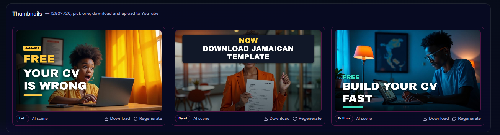
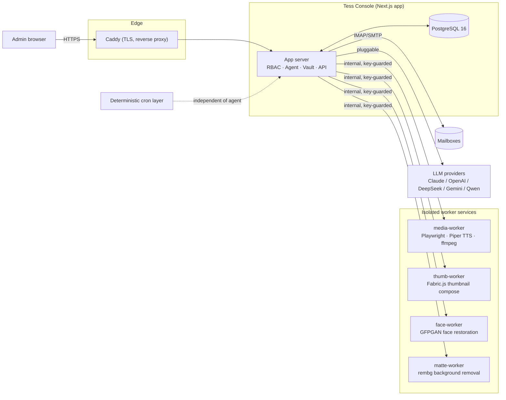

# Tess Console

**A self-hosted operations platform where an AI agent (Tess) runs marketing, content, SEO,
support, and site-health for a small portfolio of live production websites — under
role-based human oversight.**

Built solo, from empty repo to production, in TypeScript/Next.js on a self-managed VPS.

> 📌 **This is a public portfolio snapshot for hiring managers and developers to review.**
> Infrastructure runbooks, internal docs, and all secrets/credentials are excluded — this
> repo is source-for-review, not a turnkey deploy.

---

## What it is

Tess Console operates three live businesses — [calculatry.com](https://calculatry.com) (finance
calculators), [globalresumehub.com](https://globalresumehub.com) (resume tooling), and
checkinvestng.com (investment info) — through a single admin console. An AI agent ("Tess",
powered by Claude, with OpenAI/DeepSeek/Gemini/Qwen as pluggable alternatives) reads inbox
mail, drafts and publishes social posts, writes SEO content, watches uptime and rates, and
proposes/executes a whitelisted set of server actions — all inside permission boundaries a
human admin controls.

It's the kind of system that's easy to demo and hard to build correctly: real inboxes, real
money-adjacent copy, real infra, and an LLM in the loop that must never be given more trust
than the human explicitly grants it.

## Screenshots

| YouTube Pack — planner-driven thumbnails | Auto-generated OG/social banner | Auto-generated OG/social banner |
|:---:|:---:|:---:|
|  |  |  |

*(Console dashboard screenshots are withheld from this public snapshot since they render
live production data — happy to walk through the live app on a call.)*

## Feature surface

**Autonomous agent**
- Chat-driven agent with 45+ callable tools (mailbox control, publishing, secrets testing,
  server actions, notifications) gated by an explicit per-tool permission model
- A deterministic "keep running" layer (cron) so heartbeats, backups, and publishing never
  depend on the LLM being available or well-behaved
- Kill switch + per-task model routing (assign cheap/fast vs. frontier models per job type)

**Content, SEO & social**
- AI-drafted blog/SEO content with a content-strategy planner and Google Search Console
  feedback loop
- Social Studio: hook-led, platform-native post drafts (X/Facebook/Instagram/LinkedIn/
  YouTube) generated from a per-site "strategy brain," with a caption studio and Instagram
  carousel generator
- Manual-approval posting workflow — nothing goes out without a human clicking publish
- YouTube Pack: SEO titles/descriptions + AI-composited thumbnails, planner-scored against a
  CTR heuristic before you pick one
- Satori-rendered OG/social banners and Remotion-rendered demo/intro videos, generated
  on-brand per site (no generic templates)

**Unified inbox & outreach**
- Multi-mailbox IMAP/SMTP inbox with AI-drafted reply suggestions (never auto-sent),
  per-mailbox auto-reply mute, and spam/trash isolation from the action pipeline
- Cold outreach drafting with per-contact research

**Site health & analytics**
- Uptime, DNS, and exchange-rate watchdogs with root-cause diagnosis (not just "it's down")
- Self-hosted analytics with offline GeoIP (no third-party tracking dependency)
- Competitor content polling

**Admin & security**
- 3-tier RBAC (Admin / Manager / User) enforced at both the page and API layer
- Encrypted secrets vault (AES, server-only decrypt) with live "test connection" probes per
  provider — never exposes raw values to the client or logs
- Full audit log of agent + admin actions
- Automated security posture checks (firewall, fail2ban, SSH hardening, pending updates)
  surfaced to the admin, with Tess intentionally denied root

**Demo Studio**
- Scripted, narrated product-tour video generator (Playwright capture + TTS + ffmpeg
  compose) used to produce outreach and showcase material without manual screen recording

## Architecture



Each generation-heavy capability (video render, face restoration, background matting,
thumbnail compositing) is split into its own containerized worker so a slow render can never
block the request path of the main app. Everything talks over an internal Docker network,
authenticated with a shared internal key — none of it is reachable from the internet directly.

## Tech stack

| Layer | Choice |
|---|---|
| Framework | Next.js (App Router, TypeScript) |
| Database | PostgreSQL 16 + Drizzle ORM |
| UI | Tailwind CSS + shadcn/ui + Base UI |
| Auth | Argon2 password hashing, session-based, 3-tier RBAC |
| Agent / LLM | Anthropic SDK (Claude), pluggable OpenAI/DeepSeek/Gemini/Qwen |
| Mail | imapflow + mailparser + nodemailer |
| Image/graphics | Satori (banners), Sharp, Fabric.js (thumb-worker) |
| Video | Remotion, Playwright, ffmpeg, Piper TTS |
| ML workers | GFPGAN (face-worker), rembg (matte-worker) |
| Infra | Docker Compose, Caddy (reverse proxy + auto-TLS) |

## Project structure

```
app/                  Next.js application (the console itself)
  src/app/(console)/  Page routes: agent, inbox, social, seo, analytics,
                       site-health, competitors, outreach, demo-studio, settings, ...
  src/app/api/         31 route handlers (REST + internal worker callbacks)
  src/lib/             agent tools, RBAC, secrets vault, db schema (Drizzle), design engine
  drizzle/             SQL migrations
media-worker/          Demo/showcase video render pipeline (Playwright + Remotion + ffmpeg)
thumb-worker/          YouTube thumbnail compositor (Fabric.js / node-canvas)
face-worker/           Face-restoration service (GFPGAN)
matte-worker/          Background-removal service (rembg)
compose-runner/        GPU-side render orchestration for long-form showcase video
scripts/               Deterministic ops: backups, health checks, publishing, security audit
docker-compose.yml     Full service topology
```

## Running it

This snapshot excludes secrets, TLS config, and infra runbooks, so it won't deploy as-is —
but the shape is:

```bash
cp app/.env.example app/.env   # not included in this snapshot — see docker-compose.yml
                                # for the required variables (DATABASE_URL, VAULT_MASTER_KEY,
                                # SESSION_SECRET, INTERNAL_SYNC_KEY, ...)
docker compose up -d           # starts db, app, and all worker services
docker compose logs -f app
```

Secrets for third-party integrations (LLM providers, mail, analytics) are entered at runtime
through the in-app Secrets Vault — nothing is hardcoded or required at build time beyond the
core platform variables above.

## License

Proprietary — all rights reserved. Shared publicly for review purposes (portfolio, hiring,
technical due diligence). Not licensed for reuse, redistribution, or deployment. See
[LICENSE](LICENSE).
